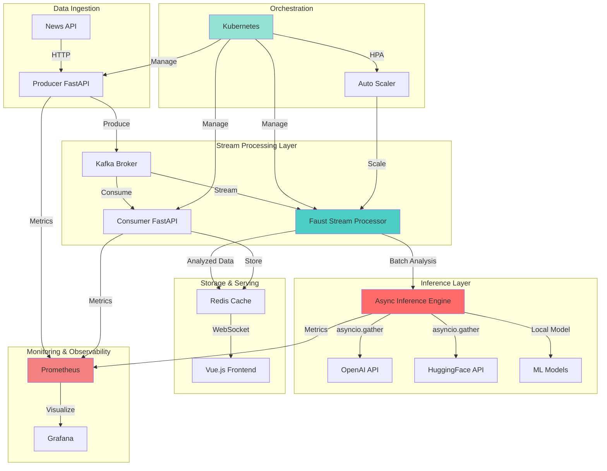
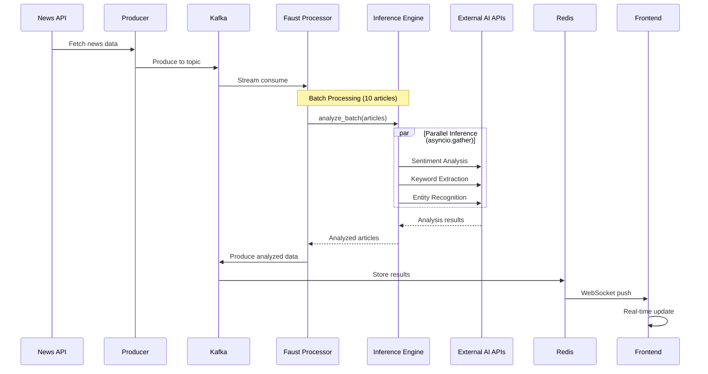

# 📰 고성능 비동기 스트림 처리 기반 뉴스 분석 엔진

**Real-time News Analysis Inference Server**

FastAPI + Kafka + Redis + Faust-Streaming을 활용한 대규모 실시간 뉴스 분석 시스템

[](https://www.python.org/)
[](https://fastapi.tiangolo.com/)
[](https://kubernetes.io/)
[](LICENSE)

---

## 🎯 프로젝트 개요

**대용량 데이터 파이프라인 처리**를 위한 고성능 비동기 추론 엔진입니다.

### 핵심 기능
- ⚡ **비동기 스트림 처리**: Faust-Streaming으로 Kafka 스트림 실시간 처리
- 🚀 **동시성 최적화**: `asyncio.gather`로 외부 AI API 호출 병렬 처리
- 🛡️ **타입 안전성**: Pydantic V2 엄격한 데이터 검증 및 정규화
- 📊 **관측 가능성**: Prometheus 메트릭으로 추론 성공률, 지연시간 모니터링
- ☸️ **클라우드 네이티브**: K8s HPA로 대량 유입 시 자동 스케일 아웃
- 🎨 **실시간 대시보드**: Vue.js + WebSocket 기반 실시간 모니터링

---

## 🏗️ 아키텍처



### 데이터 흐름 (Sequence Diagram)



## 🚀 주요 기능

### 1. 비동기 스트림 처리 (Faust-Streaming)
- Kafka 스트림 실시간 소비 및 처리
- 배치 처리로 처리량 최적화 (configurable batch size)
- Stateful 처리 및 윈도우 집계 지원

### 2. 동시성 최적화 (asyncio.gather)
- 외부 AI API 호출을 병렬로 처리하여 I/O 바운드 병목 최소화
- Semaphore로 동시 실행 제한 (rate limiting)
- Retry 메커니즘으로 안정성 확보 (tenacity)

### 3. 타입 안전성 (Pydantic V2)
- 엄격한 데이터 유효성 검사
- 커스텀 Validator로 뉴스 정규화 (HTML 제거, 공백 정리 등)
- 성능 최적화된 직렬화/역직렬화

### 4. 관측 가능성 (Prometheus)
- **추론 성공률**: `inference_success_total` / `inference_requests_total`
- **처리 지연시간**: `inference_duration_seconds` (히스토그램)
- **Kafka 상태**: `kafka_consumer_lag`
- **활성 작업**: `active_inference_tasks`

### 5. K8s 자동 스케일링
- HPA로 CPU/메모리/커스텀 메트릭 기반 오토스케일링
- GPU 리소스 관리 (선택사항)
- Pod Disruption Budget으로 안정성 보장

### 6. 실시간 대시보드
- Vue.js 3 + Composition API
- WebSocket 실시간 업데이트
- 감성 분석 결과 시각화

---

## 📦 기술 스택

### Backend
- **FastAPI 0.109+**: 고성능 비동기 웹 프레임워크
- **Faust-Streaming 0.10+**: Kafka 스트림 처리 라이브러리
- **Pydantic V2**: 데이터 검증 및 직렬화
- **asyncio**: 비동기 I/O 및 동시성 제어
- **aiokafka**: 비동기 Kafka 클라이언트
- **Python 3.11+**: 최신 Python 기능 활용

### AI/ML
- **OpenAI API**: 고급 NLP 분석 (선택사항)
- **HuggingFace**: 트랜스포머 모델 (선택사항)
- **Local Models**: 빠른 휴리스틱 기반 분석

### Infrastructure
- **Kafka**: 실시간 데이터 스트리밍
- **Redis**: 인메모리 데이터 저장소
- **Docker**: 컨테이너화
- **Kubernetes**: 오케스트레이션 및 오토스케일링
- **Prometheus**: 메트릭 수집 및 모니터링
- **Grafana**: 시각화 (선택사항)

### Frontend
- **Vue.js 3**: Composition API
- **Vite**: 빠른 개발 환경
- **WebSocket**: 실시간 양방향 통신

## 📋 사전 요구사항

- Python 3.11+
- Node.js 18+
- Docker & Docker Compose
- Kubernetes (Minikube, K3s, 또는 클라우드)
- News API 키 ([NewsAPI.org](https://newsapi.org)에서 무료 발급)

## 🛠️ 설치 및 실행

### 1. 로컬 개발 환경 (Docker Compose)

```bash
# 저장소 클론
git clone <repository-url>
cd prj-py

# 환경 변수 설정
cp .env.example .env
# .env 파일을 열어 NEWS_API_KEY를 설정하세요

# Docker Compose로 전체 스택 실행
docker-compose up -d

# 로그 확인
docker-compose logs -f
```

**서비스 접속:**
- **Inference API**: http://localhost:8000 (🆕 고성능 추론 서버)
- **Producer API**: http://localhost:8001
- **Consumer API**: http://localhost:8002
- **Frontend**: http://localhost:80
- **Prometheus**: http://localhost:9090
- **Grafana**: http://localhost:3000 (admin/admin)
- **Redis**: localhost:6379
- **Kafka**: localhost:9092

### 2. Kubernetes 배포

```bash
# Docker 이미지 빌드
docker build -t news-producer:latest -f Dockerfile.producer .
docker build -t news-consumer:latest -f Dockerfile.consumer .
docker build -t news-inference:latest -f Dockerfile.inference .

# Namespace 생성
kubectl apply -f k8s/namespace.yaml

# Secret 설정 (NEWS_API_KEY 변경 필요)
kubectl apply -f k8s/secret.yaml

# ConfigMap 적용
kubectl apply -f k8s/configmap.yaml

# Infrastructure 배포
kubectl apply -f k8s/kafka-deployment.yaml
kubectl apply -f k8s/redis-deployment.yaml

# 서비스 배포
kubectl apply -f k8s/producer-deployment.yaml
kubectl apply -f k8s/consumer-deployment.yaml
kubectl apply -f k8s/inference-deployment.yaml  # 🆕 추론 서버

# HPA 설정
kubectl apply -f k8s/hpa.yaml

# Prometheus 배포
kubectl apply -f k8s/prometheus-deployment.yaml

# 배포 상태 확인
kubectl get pods -n news-analysis
kubectl get svc -n news-analysis
kubectl get hpa -n news-analysis
```

**GPU 배포 가이드**: [k8s/GPU_DEPLOYMENT_GUIDE.md](k8s/GPU_DEPLOYMENT_GUIDE.md) 참조

### 3. Frontend 실행

```bash
cd frontend

# 의존성 설치
npm install

# 개발 서버 실행
npm run dev

# 빌드 (프로덕션)
npm run build
```

Frontend 접속: http://localhost:5173

## 📊 사용 방법

### API 엔드포인트

#### Producer Service (Port 8001)
```bash
# Health Check
curl http://localhost:8001/

# 수동 뉴스 수집 트리거
curl -X POST http://localhost:8001/fetch-now

# Prometheus 메트릭
curl http://localhost:8001/metrics
```

#### Consumer Service (Port 8002)
```bash
# Health Check
curl http://localhost:8002/

# 최근 뉴스 조회
curl http://localhost:8002/news/recent?limit=20

# 중요 뉴스 조회
curl http://localhost:8002/news/top?limit=10

# 특정 뉴스 조회
curl http://localhost:8002/news/{news_id}

# WebSocket 연결
wscat -c ws://localhost:8002/ws

# Prometheus 메트릭
curl http://localhost:8002/metrics
```

### WebSocket 메시지 형식

```javascript
// 초기 데이터
{
  "type": "initial_data",
  "data": [...] // 최근 뉴스 배열
}

// 새로운 분석 결과
{
  "type": "new_analysis",
  "data": {
    "id": "...",
    "title": "...",
    "description": "...",
    "analysis": {
      "sentiment": "positive|neutral|negative",
      "sentiment_score": 1.0,
      "keywords": ["keyword1", "keyword2"],
      "importance_score": 7.5
    }
  }
}
```

## 🔍 모니터링

### Prometheus 메트릭

**Producer 메트릭:**
- `news_fetched_total`: 총 수집된 뉴스 수
- `news_sent_total`: Kafka로 전송된 뉴스 수
- `news_fetch_duration_seconds`: 뉴스 수집 소요 시간

**Consumer 메트릭:**
- `news_consumed_total`: Kafka에서 수신한 뉴스 수
- `news_analyzed_total`: 분석 완료된 뉴스 수
- `news_stored_total`: Redis에 저장된 뉴스 수
- `news_analysis_duration_seconds`: 분석 소요 시간
- `active_websocket_connections`: 활성 WebSocket 연결 수

자세한 모니터링 가이드는 [monitoring/PROMETHEUS_GUIDE.md](monitoring/PROMETHEUS_GUIDE.md)를 참조하세요.

## 🧪 HPA 테스트

```bash
# CPU 부하 생성
kubectl run -n news-analysis load-generator \
  --image=busybox --restart=Never \
  -- /bin/sh -c "while true; do wget -q -O- http://news-producer:8001/fetch-now; done"

# HPA 상태 실시간 모니터링
kubectl get hpa -n news-analysis -w

# Pod 스케일링 확인
kubectl get pods -n news-analysis -w

# 부하 생성기 제거
kubectl delete pod load-generator -n news-analysis
```

## 🔧 커스터마이징

### 뉴스 소스 변경

[producer/news_client.py](producer/news_client.py)에서 다른 뉴스 API를 사용하도록 수정할 수 있습니다.

### 분석 로직 개선

[consumer/analyzer.py](consumer/analyzer.py)에서 더 정교한 ML 모델을 적용할 수 있습니다:
- Transformers (BERT, GPT)
- Named Entity Recognition (NER)
- Topic Modeling
- 딥러닝 감성 분석

### Kafka 파티션 증가

```bash
# Kafka에 접속하여 토픽 파티션 수 변경
docker exec -it kafka kafka-topics --alter \
  --zookeeper zookeeper:2181 \
  --topic news_stream \
  --partitions 6
```

## 📁 프로젝트 구조

```
prj-py/
├── producer/                 # Producer 서비스
│   ├── main.py              # FastAPI 앱
│   ├── kafka_producer.py    # Kafka 프로듀서
│   ├── news_client.py       # 뉴스 API 클라이언트
│   └── config.py            # 설정
├── consumer/                 # Consumer 서비스
│   ├── main.py              # FastAPI 앱
│   ├── kafka_consumer.py    # Kafka 컨슈머
│   ├── analyzer.py          # 뉴스 분석 로직
│   ├── redis_storage.py     # Redis 저장소
│   └── config.py            # 설정
├── frontend/                 # Vue.js 프론트엔드
│   ├── src/
│   │   ├── App.vue          # 메인 컴포넌트
│   │   └── main.js
│   ├── index.html
│   ├── vite.config.js
│   └── package.json
├── k8s/                      # Kubernetes 매니페스트
│   ├── namespace.yaml
│   ├── configmap.yaml
│   ├── secret.yaml
│   ├── producer-deployment.yaml
│   ├── consumer-deployment.yaml
│   ├── hpa.yaml
│   └── prometheus-deployment.yaml
├── monitoring/               # 모니터링 설정
│   ├── prometheus.yml
│   └── PROMETHEUS_GUIDE.md
├── docker-compose.yml        # Docker Compose 설정
├── Dockerfile.producer       # Producer Dockerfile
├── Dockerfile.consumer       # Consumer Dockerfile
├── requirements.txt          # Python 의존성
└── README.md                 # 이 파일
```

## 🐛 트러블슈팅

### Kafka 연결 오류
```bash
# Kafka가 시작될 때까지 대기
docker-compose logs kafka

# Kafka 토픽 확인
docker exec -it kafka kafka-topics --list --bootstrap-server localhost:9092
```

### Redis 연결 오류
```bash
# Redis 연결 테스트
docker exec -it redis redis-cli ping

# Redis 데이터 확인
docker exec -it redis redis-cli keys "*"
```

### WebSocket 연결 실패
- CORS 설정 확인
- 방화벽 설정 확인
- Consumer 서비스가 실행 중인지 확인

### HPA가 작동하지 않을 때
```bash
# Metrics Server 설치 확인
kubectl get deployment metrics-server -n kube-system

# 없으면 설치
kubectl apply -f https://github.com/kubernetes-sigs/metrics-server/releases/latest/download/components.yaml
```

## 📚 학습 포인트

이 프로젝트를 통해 다음을 학습할 수 있습니다:

1. **고성능 비동기 처리**: asyncio.gather를 활용한 I/O 바운드 병목 최소화
2. **스트림 처리**: Faust-Streaming으로 Kafka 스트림 실시간 처리
3. **타입 안전성**: Pydantic V2 커스텀 Validator로 데이터 정규화
4. **메시지 큐**: Kafka를 통한 이벤트 드리븐 아키텍처
5. **마이크로서비스**: Producer/Inference/Consumer 분리 설계
6. **실시간 통신**: WebSocket 구현
7. **컨테이너화**: Docker 멀티 스테이지 빌드
8. **오케스트레이션**: Kubernetes HPA 및 GPU 리소스 관리
9. **모니터링**: Prometheus 커스텀 메트릭 설계
10. **CI/CD**: GitHub Actions 자동화 파이프라인

## 🎯 성능 벤치마크

### 처리량
- **단일 추론**: ~50ms/article (로컬 모델)
- **배치 추론**: ~30ms/article (10개 배치)
- **동시 처리**: 최대 20 concurrent requests (configurable)

### 스케일링
- **최소 레플리카**: 2
- **최대 레플리카**: 20
- **스케일업 시간**: ~30초
- **스케일다운 안정화**: 5분

### 리소스
- **메모리**: 2-4GB per pod
- **CPU**: 1-2 cores per pod
- **GPU**: 선택사항 (1 GPU per pod)

## 🚀 다음 단계

프로젝트를 더 발전시키기 위한 아이디어:

### 단기 (1-2주)
- [x] FastAPI 비동기 추론 서버 구현
- [x] Faust-Streaming 통합
- [x] Pydantic V2 모델 및 Validator
- [x] Prometheus 메트릭
- [x] K8s HPA 설정
- [x] GitHub Actions CI/CD
- [ ] Unit/Integration 테스트 추가
- [ ] Load testing (k6/Locust)

### 중기 (1-2개월)
- [ ] 실제 ML 모델 통합 (Transformers, BERT)
- [ ] 다국어 지원 (다국어 감성 분석)
- [ ] Elasticsearch 통합 (전문 검색)
- [ ] GraphQL API 추가
- [ ] 뉴스 카테고리별 자동 분류
- [ ] WebSocket 인증 및 개인화
- [ ] Alerting 시스템 (Alertmanager)

### 장기 (3-6개월)
- [ ] 사용자 인증 및 권한 관리
- [ ] 추천 시스템 (개인화된 뉴스 피드)
- [ ] A/B 테스트 프레임워크
- [ ] Multi-tenancy 지원
- [ ] Edge Computing 배포
- [ ] 데이터 레이크 통합 (S3, Delta Lake)

## 📖 관련 문서

- [QUICKSTART.md](QUICKSTART.md) - 1분 환경 구성 가이드
- [PROJECT_STRUCTURE.md](PROJECT_STRUCTURE.md) - 프로젝트 구조 상세
- [k8s/GPU_DEPLOYMENT_GUIDE.md](k8s/GPU_DEPLOYMENT_GUIDE.md) - GPU 배포 가이드
- [monitoring/PROMETHEUS_GUIDE.md](monitoring/PROMETHEUS_GUIDE.md) - 모니터링 가이드
- [.github/workflows/ci-cd.yml](.github/workflows/ci-cd.yml) - CI/CD 파이프라인

## 🔗 참고 자료

### 공식 문서
- [FastAPI](https://fastapi.tiangolo.com/)
- [Faust-Streaming](https://faust-streaming.github.io/faust/)
- [Pydantic V2](https://docs.pydantic.dev/latest/)
- [Kafka](https://kafka.apache.org/documentation/)
- [Kubernetes](https://kubernetes.io/docs/)
- [Prometheus](https://prometheus.io/docs/)

### 관련 프로젝트
- [Bytewax](https://github.com/bytewax/bytewax) - Python 스트림 처리
- [aiokafka](https://github.com/aio-libs/aiokafka) - 비동기 Kafka 클라이언트
- [Ray Serve](https://docs.ray.io/en/latest/serve/) - ML 모델 서빙

## 📄 라이센스

MIT License

## 👥 기여

이슈와 PR을 환영합니다!

### 기여 가이드
1. Fork the repository
2. Create your feature branch (`git checkout -b feature/AmazingFeature`)
3. Commit your changes (`git commit -m 'Add some AmazingFeature'`)
4. Push to the branch (`git push origin feature/AmazingFeature`)
5. Open a Pull Request

## 🙏 감사의 말

이 프로젝트는 다음 오픈소스에 기반합니다:
- FastAPI
- Faust-Streaming
- Apache Kafka
- Redis
- Kubernetes
- Prometheus

## 📧 문의

프로젝트 관련 문의사항은 GitHub Issues를 통해 남겨주세요.

프로젝트 관련 문의사항이 있으시면 이슈를 등록해주세요.

---

**Happy Coding! 🎉**
